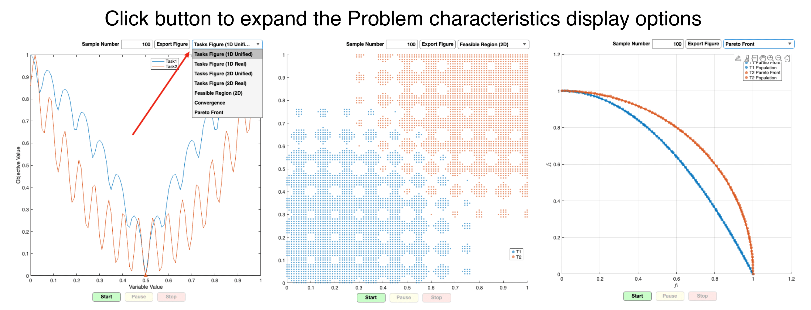
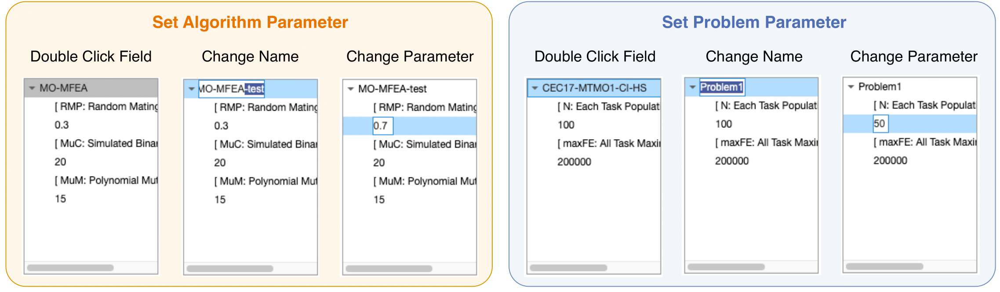
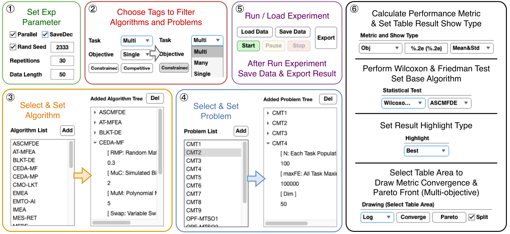

# 🧭 MTO 平台用户指南（中文版）

[→ English Guide](./User-Guide.md)

[](#)
[](#)

## 快速上手

### 运行 MTO 平台

- **GUI:** `mto`
- **命令行示例:**
```matlab
mto({MFEA, MFDE},{CMT1, CMT2})
mto({MFEA, MFDE},{CMT1, CMT2}, 5, true, 100, false, 'MTOData.mat', 2333)
mto({MFEA, MFDE},{CMT1, CMT2}, 'Reps', 5, 'Par_Flag', true)
````

### 添加算法

1. 继承 `Algorithms` 文件夹下的 **Algorithm.m** 类
2. 实现方法：

```matlab
function run(Algo, Prob)
```

3. 在第二行添加标签：

```
<Multi-task/Many-task/Single-task> <Multi-objective/Single-objective> <None/Competitive/Constrained>
```

4. 可参考 `MFEA` 或 `MO-MFEA` 实现。

### 添加问题

1. 继承 `Problem` 文件夹下的 **Problem.m** 类
2. 实现方法：

```matlab
function Tasks = setTasks()
```

3. 在第二行添加标签：

```
<Multi-task/Many-task/Single-task> <Multi-objective/Single-objective> <None/Competitive/Constrained>
```

4. 可参考 `CEC17_MTSO` 或 `MTMO_Instance1`。

### 添加指标

1. 继承 `Metric` 文件夹下的 **Metric.m** 类
2. 第二行添加标签：`<Metric>`
3. 可参考 `Obj.m` 和 `IGD.m`。

---

## 模块介绍

### 1. 测试模块





* **算法选择:** 选择算法并展开，可双击修改参数
* **问题选择:** 选择问题并展开，可双击修改参数
* **运行:** 点击 **Start**
* **查看图像:**

  * 问题 1D 图（归一化 / 原始）
  * 问题 2D 图（归一化 / 原始）
  * 可行域 2D 图
  * 收敛图
  * Pareto 前沿

### 2. 实验模块




1. **参数设置:**

   * Repetitions: 独立重复次数
   * Data Length: 收敛数据长度
   * Save Dec: 保存决策变量标志
   * Parallel: 并行执行标志

2. **算法选择:**

   * 点击 **Add** 添加算法到 Selected Algorithms
   * 展开并双击修改参数或算法名称
   * 可多选，右键全选

3. **问题选择:**

   * 点击 **Add** 添加问题到 Selected Problems
   * 展开并双击修改参数或问题名称
   * 可多选，右键全选

4. **开始 / 暂停 / 停止**

   * 点击 **Start** 开始运行
   * 点击 **Pause** 暂停，再点击 **Resume** 继续
   * 点击 **Stop** 终止

5. **表格统计:**

   * 显示指标并绘制收敛图 / Pareto 前沿
   * 数据类型: 平均值, 平均值&标准差, 标准差, 中位数, 最优, 最差
   * 统计测试: 无, Wilcoxon, Friedman
   * 高亮数据: 无, 高亮最优, 高亮最优&最差
   * 点击 **Save** 保存表格数据

6. **读取 / 保存数据**

   * 点击 **Save Data** 保存实验数据
   * 点击 **Load Data** 读取保存的数据

### 3. 数据处理模块


1. **读取数据:** 点击 **Load Data** 将数据加入 Data Tree
2. **删除数据:** 选中数据点击 **Delete Data**
3. **保存数据:** 选中数据点击 **Save Data**
4. **数据分割:** 按 Reps / 算法 / 问题
5. **数据合并:** 按 Reps / 算法 / 问题

---

## 小贴士

* 可根据问题类型选择对应算法处理多任务/大规模多任务问题
* 并行标志仅对独立重复有效
* 请在计算指标数据后保存数据
