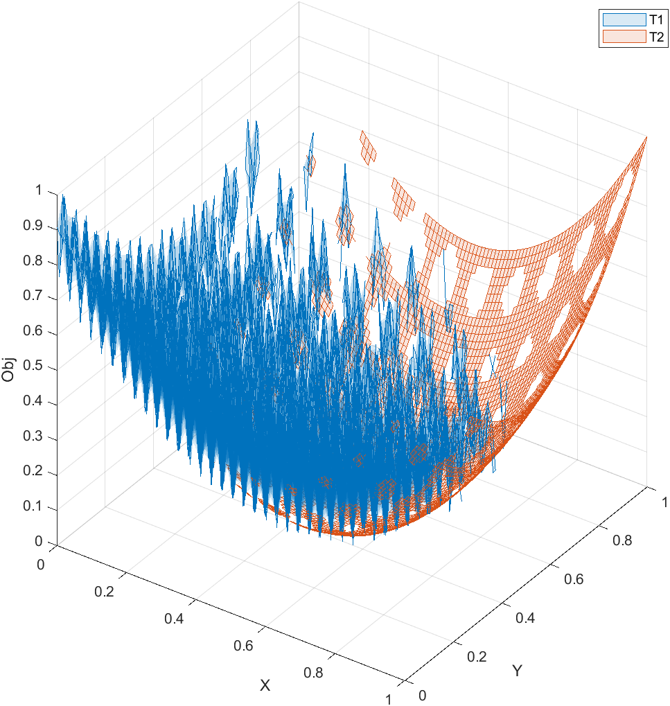
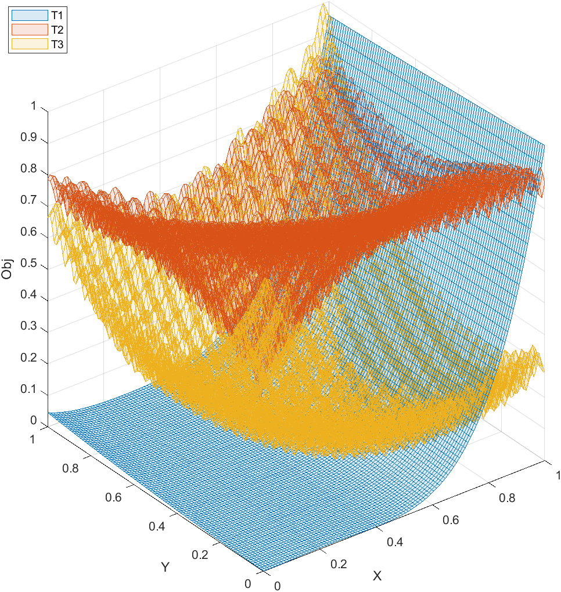
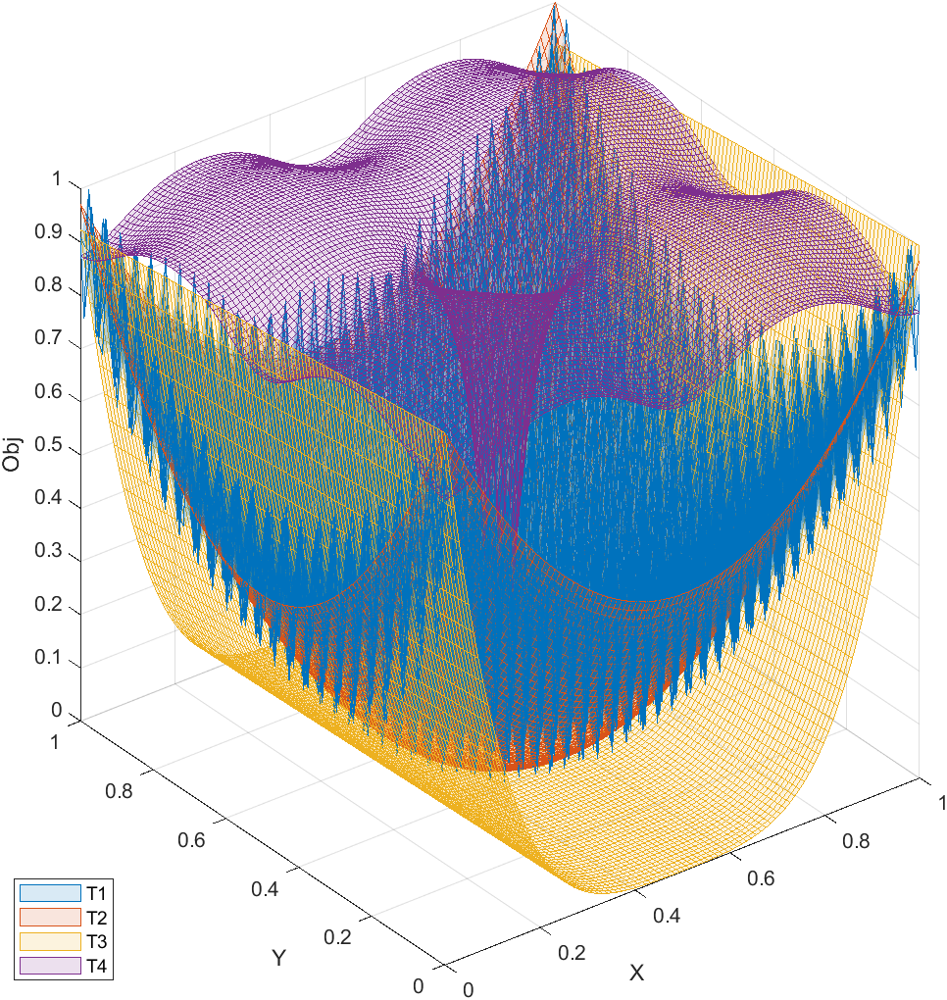

# Multitask Optimization Platform (MToP)

[](https://github.com/intLyc/MTO-Platform/archive/refs/heads/master.zip)
[](#mto-platform)
[](#mto-platform)

[](#mto-platform)
[](#mto-platform)
[](#mto-platform)



We introduce the multitask optimization platform, named **MToP**, for evolutionary multitasking:

- 40+ multitask evolutionary algorithms for multitask optimization
- 40+ single-task evolutionary algorithms that can handle multitask optimization problems
- 150+ multitask optimization problem cases with real-world applications
- 150+ classical single-task optimization benchmark problems
- 10+ performance metrics covering single- and multi-objective optimization

MToP is a user-friendly tool with a graphical user interface that makes it easy to analyze results, export data, and plot schematics. More importantly, MToP is extensible, allowing users to develop new algorithms and define new problems.

**Documents:**
[**[Paper - Click Here]**](https://arxiv.org/abs/2312.08134) /
[**[User Guide - Click Here]**](./Doc/User-Guide.md)

## Release Highlights of MToP v1.2

- Newly added algorithms:
  - TRADE (single-objective many-task TCYB 2023)
  - ASCMFDE (single-objective multitask TEVC 2021)
- Add error value type of WCCI20-MTSO
- Update Operator GA (SBX and polynomial mutation) with more advanced calculation methods. GA-based algorithms now have improved performance.

## Release Highlights of MToP v1.1

- The speed of experimental execution is significantly increased, brought by the simultaneous evaluation of whole population decision variables
- 3D task figures of 2-dimensional variables for un-/constrained single-objective multi-/many-/single-task optimization can be plotted in the test module
- Performance metrics can be displayed automatically based on the data type in the experiment module
- Newly added algorithms:
  - MKTDE (single-objective multi-task TEVC 2022)
  - CCEF-ECHT (constrained single-objective TSMC 2023)

## Copyright

> Copyright (c) Yanchi Li. You are free to use the MToP for research purposes. All publications which use this platform should acknowledge the use of *"MToP"* or *"MTO-Platform"* and cite as *"Y. Li, W. Gong, F. Ming, T. Zhang, S. Li, and Q. Gu, MToP: A MATLAB Optimization Platform for Evolutionary Multitasking, 2023, arXiv:2312.08134"*

```
@Article{Li2023MToP,
  title   = {{MToP}: A {MATLAB} Optimization Platform for Evolutionary Multitasking},
  author  = {Yanchi Li and Wenyin Gong and Fei Ming and Tingyu Zhang and Shuijia Li and Qiong Gu},
  journal = {arXiv preprint arXiv:2312.08134},
  year    = {2023},
  eprint  = {2312.08134},
}
```

## Contact Us

*Email: <int_lyc@cug.edu.cn>*

*QQ Group: 862974231*

## Related Websites

[*MTO Website*](http://www.bdsc.site/websites/MTO/index.html)
/
[*ETO Website*](http://www.bdsc.site/websites/ETO/ETO.html)
